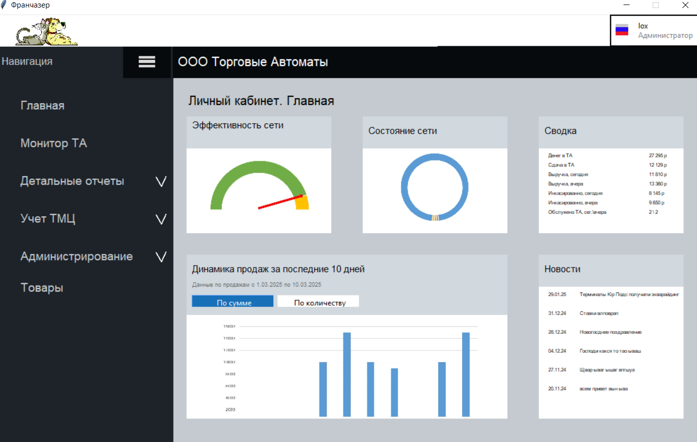
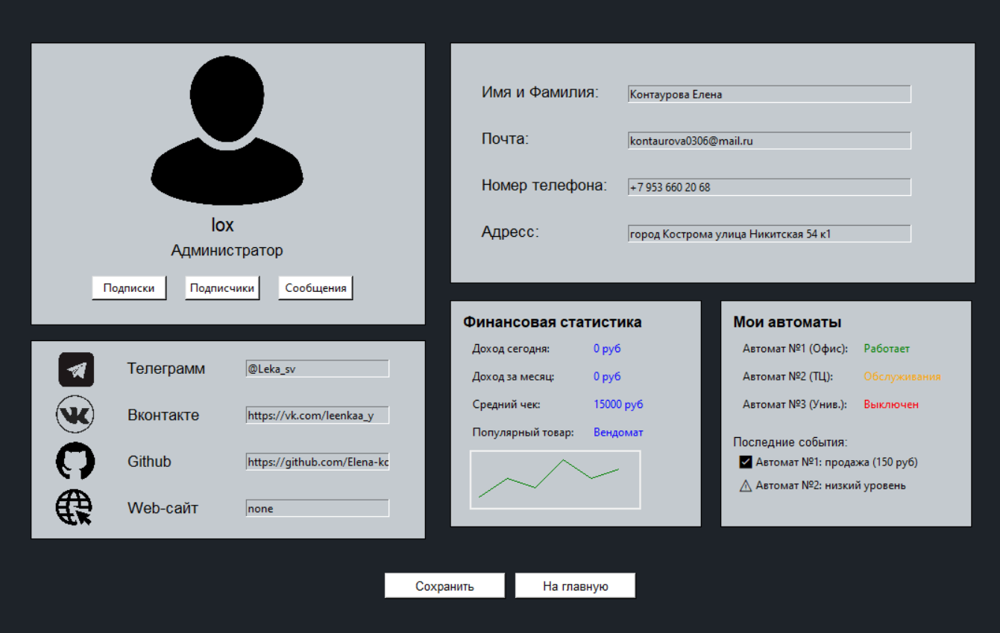

ПРИЛОЖЕНИЕ ВЕНДИНГОВЫЕ АППАРАТЫ

ЗАПУСК ПРОГРАММЫ - [файл](glavnay.py) - py glavnay.py

---

1. Авторизация и регистрация

При входе в приложение - открыть страница с авторизацей, если профиля еще нет,
то надо переключиться на страницу с регистрацией.
При вводе верных данных - надо решить капчу. 
Если все успешно - Добро пожаловать на главную страницу 
---

2. Меню

Слева находится меню:
 - Главная
 - Монитор ТА
 - Детальные отчеты 
  - Отчет торговые автоматы
  - Отчет мониторы
  - Отчет компании
 - Учет ТМЦ
  - Аппараты для напитков
  - Аппараты для сладостей 
  - Аппараты для снэков
 - Администрирование
  - Торговые автоматы
  - Компании
  - Пользователи 
  - Модемы
  - Дополнительно
 - Товары
Меню и подменю
---

3. Главная

Страницы содержит блоки - эффективность сети (график отображающий  ее эффективность)
Состояние сети - Круговая диаграмма
Сводка - данные из таблицы 
Динамика продаж - График по сумме и по количеству 
Новости - данные из бд 
---

4. Монитор ТА

Сортировака по общему состоянию, подключению, дополнительному статусу (в работе)
Таблицы с данными из бд - Торговый автомат, связь, загрузка, Денежные стредства, Событи,
Оборудование, Информация, дополнительно
---

5. Отчет торговые автоматы, мониторы, компании

Содержится некая информация из таблиц о автоматах, мониторах, компаниях.
Всю предоставленную информацию можно экспортировать в pdf, excel, csv, .txt
---

6. Учет ТМЦ
Страницы: Аппараты для напитков, сладростей, снэков
Содержит: диагрмма расходов, спрос на товар, дата последней закупки, 
Две круговых диаграммы, форму для заказа оппарата
---

7. Администрирование/ Торговые автоматы 
Таблица торговые автоматы
Поля - id, название автомата, модель, компания, модем, адресс, место, в работе с
Действия - создание, редактирование, удаление записей 
---

8. Администрирование/ Компании
Таблица - Список компаний 
Поля - Название, вышестоящяя, адресс, контакты, в работе с 
Действия - добавление, редактирование, удаление записей
---

9. Администирование/ Пользователи
Таблица - Список пользователей
Поля - Фио пользоватея, email, телефон, роль
Действия - недоступны
---

10. Администрование/ модемы
Таблица - Список модемов
Поля - модель, стандарт wifi, интервейс, страна
Действия - недоступны 
---

11. Администрование/ Дополнительно
Таблица - Обновления
Поля - Дата последнего и предстоящего релиза
---

12. Товары
Фото вендинтовых аппаратов - и переход на их страницы
---

ПРОФИЛЬ ПОЛЬЗОВАТЕЛЯ 
Поля для заполнения: телеграмм, вк, github, веб сайт
                    Имя и Фамилия, Почта, Номер, Адресс
Финансовая статистика
Мои автоматы 
---

Настроено разделениена админов и обычных пользователей
Обычным пользователям недостпуно добавлени, редавктирование, удаление таблицы.
Только просмотр. 

